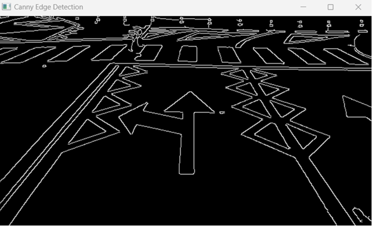

# Road Marking Detection

## Overview
This project develops a robust solution for detecting road markings using image processing technologies. It's designed to assist drivers and autonomous driving systems by enhancing road safety and navigation. The system processes images captured from vehicle-mounted cameras, utilizing computer vision algorithms to analyze and interpret the visual characteristics of the roads.

## Key Features
- **Grayscale Conversion**: Simplifies images for further processing, focusing on intensity over color.
- **Gaussian Blurring**: Reduces noise in the image, enhancing the effectiveness of edge detection algorithms.
- **Canny Edge Detector**: Identifies significant transitions in intensity to highlight edges, crucial for detecting the boundaries of road markings.
- **Region of Interest (ROI) Selection**: Focuses the processing on specific areas likely to contain road markings, enhancing processing speed and accuracy.
- **Hough Transform**: Used for detecting straight lines, which are typical in road markings.
- **User Interface**: Allows for easy interaction with the system, adjusting settings, and viewing processed data in real-time.

## Technologies Used
- **OpenCV**: Primary library for image processing operations.
- **Python**: Main programming language used for implementing the algorithms and managing the application flow.

